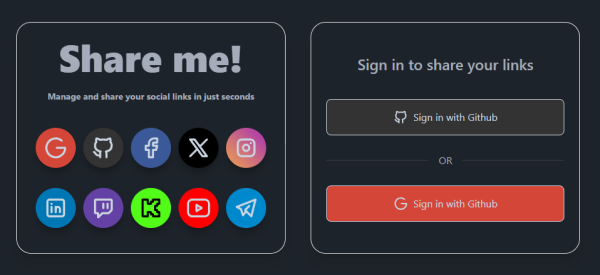
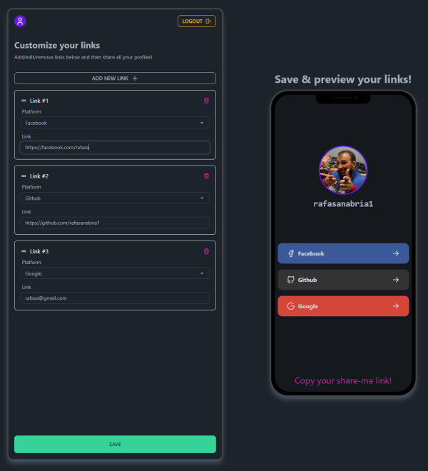
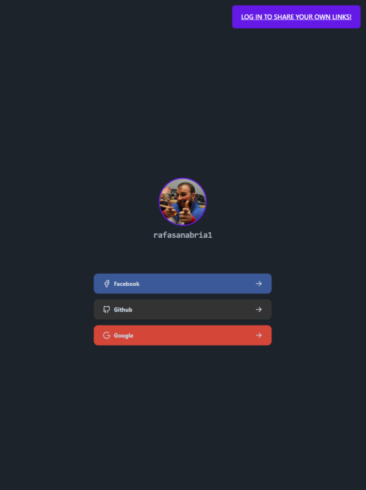

# Share me!

## Descripción

Este repositorio contiene una aplicación en la que podrás iniciar sesión con GitHub o Google, agregar tus links sociales preferidos, ¡y obtener un link para compartirlos! Actualmente, las plataformas permitidas son:
  1. Google
  2. GitHub
  3. Facebook
  4. X
  5. Instagram
  6. LinkedIn
  7. Twitch
  8. Kick
  9. Youtube
  10. Telegram

## Sitio público

Puedes ver este proyecto desplegado en [https://share-me-rs1.vercel.app/](https://share-me-rs1.vercel.app/), o puedes instalarlo y probarlo en tu entorno local siguiendo las instrucciones de instalación.

## Tecnologías utilizadas

- [NextJS](https://nextjs.org/)
- [TailwindCSS](https://tailwindcss.com/)
- [Supabase](https://supabase.com/)

## Tareas en desarrollo
- Implementar posibilidad de editar nombre de usuario y avatar.
- Implementar posibilidad de seleccionar color de fondo en la vista pública del enlace personalizado.
- Agregar más plataformas.
- Agregar posibilidad de seleccionar idioma.

## Imágenes de la aplicación
<p align="center">
  
</p>
<p align="center">
  
</p>
<p align="center">
  
</p>

## Instalación

1. Clona este repositorio:
   `git clone https://github.com/rafasanabria1/share-me.git`

2. Navega a la carpeta del proyecto:
   `cd share-me`

3. Configura las variables de entorno necesarias creando en el archivo `env.local` o editando el archivo `.env`:
    ```
    NEXT_PUBLIC_SUPABASE_URL=your-supabase-url
    NEXT_PUBLIC_SUPABASE_ANON_KEY=your-supabase-anon-key
    NEXT_PUBLIC_BASE_URL='your-base-url'
    ```

4. Instala las dependencias:
   `npm install`

5. Ejecuta el proyecto:
   `npm run dev`

Visita `http://localhost:3000` en tu navegador para ver la aplicación en funcionamiento.
